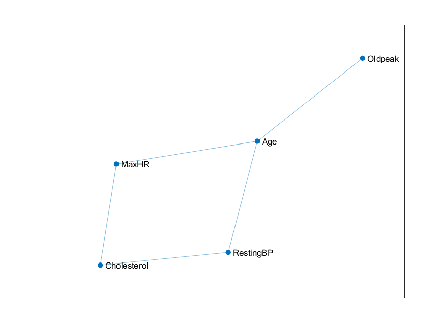

```{r setup, include=FALSE}
knitr::opts_chunk$set(echo = TRUE)
knitr::opts_chunk$set(warning = FALSE, message = FALSE)
```

```{r, include=FALSE}
library(MASS)
library(pROC)
library(class)
library(ggplot2)
library(ggcorrplot)
library(gridExtra)
library(corrplot)
library(correlation)
library(ggm)
library(igraph)
library(tidymodels)
library(naivebayes)
library(ROCR)
library(glmnet)
library(stats)

data <- read.csv("data/heart_data.csv", stringsAsFactors = T)

attach(data)
```

## Project goal and dataset description
https://www.kaggle.com/datasets/fedesoriano/heart-failure-prediction

The dataset consists of medical data from 5 different hospitals.
This data informs us of the presence of coronary heart disease.

Our main goal is to predict the presence of this condition given the other parameters in the dataset.

This dataset has a number of 12 parameters and presents us 918 observations.

The parameters are:

1. **Age**: age of the patient [years]

2. **Sex**: sex of the patient [M: male, F: female]

3. **ChestPainType**: chest pain type [TA: typical angina, ATA: atypical angina, NAP: non-anginal pain, ASY: asymptomatic]

+ Angina is a type of chest pain caused by reduced blood flow to the heart. Angina is a symptom of coronary heart disease.

4. **RestingBP**: resting blood pressure [mmHg]

5. **Cholesterol**: serum cholesterol [mm/dl]

6. **FastingBS**: fasting blood sugar [1: if FastingBS > 120 mg/dl, 0: otherwise]

+ This measures the blood sugar level after an overnight fast.

7. **RestingECG**: resting electrocardiogram results [Normal: normal, ST: having ST-T wave abnormality (T wave inversions and/or ST elevation or depression of > 0.05 mV), LVH: showing probable or definite left ventricular hypertrophy by Estes' criteria]

8. **MaxHR**: maximum heart rate achieved [numeric value between 60 and 202]

9. **ExerciseAngina**: exercise-induced angina [Y: yes, N: no]

10. **Oldpeak**: oldpeak = ST [numeric value between -2.6 and 6.2]

+ ST depression refers to a finding on an electrocardiogram, wherein the trace in the ST segment is abnormally low below the baseline.
Oldpeak measures the depression of the ST slope.

11. **ST_Slope**: the slope of the peak exercise ST segment [Up: upsloping, Flat: flat, Down: downsloping]

12. **HeartDisease**: output class [1: heart disease, 0: normal]

<br>

## Data visualization and cleaning
In this section we want to visualize our data and clean it. In order to that we have to:

* Visualize the distribution of the target variable

* Visualize the distribution of the predictors

* Deal with missing values

* Deal with outliers

* Find correlations between the parameters

<br>

### Data balance check
```{r, include=TRUE}
prop.table(table(HeartDisease))
```

The target variable is quite balanced.

<br>

### Continuous variables
Now we plot the continuous variables with respect to the target variable.

```{r, include=FALSE}
# continuous variables
cont.idx <- c(1,4,5,8,10)

colours <- c("#F8766D", "#00BFC4")

# Age
age.plot <- ggplot(data, aes(x=Age, group=HeartDisease,
                             fill=factor(HeartDisease))) +
  geom_density(alpha=0.4) + 
  ggtitle("Age - Density Plot") + xlab("Age") +
  guides(fill = guide_legend(title="Heart disease"))

# RestingBP
restingBP.plot <- ggplot(data, aes(x=RestingBP, group=HeartDisease,
                               fill=factor(HeartDisease))) +
  geom_density(alpha=0.4) + 
  ggtitle("RestingBP - Density Plot") + xlab("RestingBP") +
  guides(fill = guide_legend(title="Heart disease"))

# Cholesterol
chol.plot <- ggplot(data, aes(x=Cholesterol, group=HeartDisease,
                                            fill=factor(HeartDisease))) +
  geom_density(alpha=0.4) + 
  ggtitle("Cholesterol - Density Plot") + xlab("Cholesterol") +
  guides(fill = guide_legend(title="Heart disease"))

# MaxHR
maxHR.plot <- ggplot(data, aes(x=MaxHR, group=HeartDisease,
                               fill=factor(HeartDisease))) +
  geom_density(alpha=0.4) + 
  ggtitle("MaxHR - Density Plot") + xlab("MaxHR") +
  guides(fill = guide_legend(title="Heart disease"))

# Oldpeak
oldpeak.plot <- ggplot(data, aes(x=Oldpeak, group=HeartDisease,
                               fill=factor(HeartDisease))) +
  geom_density(alpha=0.4) + 
  ggtitle("Oldpeak - Density Plot") + xlab("Oldpeak") +
  guides(fill = guide_legend(title="Heart disease"))

# FastingBS
fastingBS.plot <- ggplot(data, aes(x=FastingBS, group=HeartDisease,
                                   fill=factor(HeartDisease))) +
  geom_bar(alpha=0.5, position="dodge") +
  guides(fill = guide_legend(title="Heart disease"))

```

```{r, include=TRUE}
chol.plot
oldpeak.plot
fastingBS.plot
```

```{r, include=TRUE}
age.box <- boxplot(Age ~ HeartDisease, col=colours)
maxHR.box <- boxplot(MaxHR ~ HeartDisease, col=colours)
```

<br>

### Categorical variables
```{r, include=FALSE}
# Sex
sex.plot <- ggplot(data, aes(x=Sex, group=HeartDisease,
                                   fill=factor(HeartDisease))) +
  geom_bar(alpha=0.5, position="dodge") +
  guides(fill = guide_legend(title="Heart disease"))

# ChestPainType
cpt.plot <- ggplot(data, aes(x=ChestPainType, group=HeartDisease,
                                   fill=factor(HeartDisease))) +
  geom_bar(alpha=0.5, position="dodge") +
  guides(fill = guide_legend(title="Heart disease"))

# RestingECG
restingECG.plot <- ggplot(data, aes(x=RestingECG, group=HeartDisease,
                                   fill=factor(HeartDisease))) +
  geom_bar(alpha=0.5, position="dodge") +
  guides(fill = guide_legend(title="Heart disease"))

# ExerciseAngina
exAn.plot <- ggplot(data, aes(x=ExerciseAngina, group=HeartDisease,
                                   fill=factor(HeartDisease))) +
  geom_bar(alpha=0.5, position="dodge") +
  guides(fill = guide_legend(title="Heart disease"))

# ST_Slope
st.plot <- ggplot(data, aes(x=ST_Slope, group=HeartDisease,
                                   fill=factor(HeartDisease))) +
  geom_bar(alpha=0.5, position="dodge") +
  guides(fill = guide_legend(title="Heart disease"))

```

```{r, include=TRUE}
cpt.plot
restingECG.plot
exAn.plot
st.plot
```

### Missing values
We have seen from the plots that there are 172 variables in Cholesterol that have value equal to 0. Also we have noted that patients that have Cholesterol equal to 0 are very likely to have the heart disease.

One possibility is that the measurements were taken after the patient was dead, but if we inspect we see that the rows with missing data have RestingBP and MaxHR greater than 0 and RestingECG readings include "Normal" so it safe to assume that these patients are alive and the Cholesterol value was incorrectly recorded.

Another guess is that the "serum cholesterol" measured by this variable combines the HDL and LDL values. High HDL and LDL would cancel each other out, making this variable less useful.

For this reason we decided not to use this variable in the models and as we are going to see it doesn't affect much the predictions.


``` {r, include=TRUE}
head(data[Cholesterol == 0, c("RestingBP", "MaxHR", "RestingECG")])
```

<br>

### Outliers
For each continuous variable we see that:

* Age: no outliers

* RestingBP: the presence of outliers with high value is plausible

* MaxHR: no outliers

* Oldpeak: the values are in the range [-2, 6], there are many values equal to 0

<br>

### Correlations
```{r, include=TRUE}
cor.data <- cor(data[,cont.idx])
corrplot(cor.data,
         method="color",
         diag=F,
         tl.cex=0.4,
         number.cex=0.5,
         tl.col="black",
         addCoef.col="grey50",
         cl.pos="n")
```

<br>

### Graph
We visualize the igraph to see the relationships between the continuous variables.

```{r, include=TRUE}
S <- var(data[,cont.idx])
R <- -cov2cor(solve(S))
G <- abs(R)>0.1
diag(G) <- 0
```

{width="50%"}

<br>

### Data Preparation
We divide our data in the training set and the test set.

```{r, include=TRUE}
set.seed(123)
split <- initial_split(data[,-c(5)], prop=0.75)

train <- training(split)
test <- testing(split)
```

```{r, include=FALSE}
calculate.metrics <- function(conf.mat) {
  acc <- sum(diag(conf.mat))/sum(conf.mat)
  prec <- conf.mat[2,2] / sum(conf.mat[,2])
  rec <- conf.mat[2,2] / sum(conf.mat[2,])
  f1.score <- 2*prec*rec/(prec+rec)
  out <- list(acc, prec, rec, f1.score)
  return(out)
}

model.plot.roc <- function(predm, labl) {
  pred <- prediction(predm, labl)
  perf <- performance(pred, measure="tpr", x.measure="fpr")
  plot(perf, main="ROC")
  abline(a=0, b= 1)
  auc.perf <- performance(pred, measure = "auc")
  return(auc.perf@y.values)
}

```

<br>

## Evaluation

We chose to try different classification models, like Logistic Regression, Naive Bayes, LDA and QDA. For the former, we also used Lasso Regression and Ridge Regression. The goal is to predict whether or not heart disease is present in the patient.

<br>

### LDA
Linear Discriminant Analysis (LDA) is a classification algorithm, where a discriminant rule tries to divide the data points into K disjoint regions, where K is the number of classes (in this case K = 2).

To do that we assume that our data follows a normal distribution and the classes have the same variance, and then we define a discriminant function, which tells us how likely is the observation to follow into a particular class.

$$\delta_{k}(x) = log(f_{k}) + log(\pi_{k}) $$
The decision boundary separating the classes is the set of x where two discriminant functions have the same value. Therefore, any data that falls on the decision boundary is equally likely from all the classes.

```{r, include=TRUE}
lda.fit <- lda(HeartDisease~., data=train)
lda.fit
lda.pred <- predict(lda.fit, test, type="response")
lda.res <- lda.pred$posterior

# if we want to minimize the false positives the best result is when t = 0.6
lda.pred.best <- as.factor(ifelse(lda.res[,2] > 0.6, 1, 0))

lda.conf.mat <- table(test$HeartDisease, lda.pred.best)
lda.conf.mat

# accuracy, precision, recall, f1 score
lda.metrics <- calculate.metrics(lda.conf.mat)
lda.metrics
```

The Receiver Operating Characteristics traces out two types of error as we vary the threshold for the posterior probability:

* The true positive rate or sensitivity: the fraction of patients having the heart condition that are correctly identified

* The false positive rate: the fraction of patients without the conditions that we classify incorrectly with having the disease

The dotted line represents the “no information”
classifier; this is what we would expect if the predictors are not associated with probability of having the heart disease.

```{r, include=TRUE}
# ROC
lda.auc <- model.plot.roc(lda.res[,2], test$HeartDisease)
lda.auc

ldahist(lda.pred$x[,1], g=lda.pred$class, col=2)
```

<br>

### QDA
Quadratic Discriminant Analysis (QDA) doesn't assume the equal variance of the classes. For this reason the decision boundary is not linear but quadratic.

```{r, include=TRUE}
qda.fit <- qda(HeartDisease~., data=train)

qda.pred <- predict(qda.fit, test)
qda.pred.best <- as.factor(ifelse(lda.res[,2] > 0.5, 1, 0))

qda.conf.mat <- table(qda.pred.best, test$HeartDisease)
qda.conf.mat

qda.metrics <- calculate.metrics(qda.conf.mat)
qda.metrics

qda.auc <- model.plot.roc(qda.pred$posterior[,2], test$HeartDisease)
qda.auc

```

<br>

### Simple Logistic Regression

Logistic Regression is the easiest and most common model to perform binary classification. The family set is binomial, as the dependent variable is binary.


```{r, include=TRUE}
glm.model <- glm(data=train, HeartDisease~., family="binomial")
glm_summary <- summary(glm.model)
glm_summary
```


We calculate the odds of success given the R-squared value, so that we evaluate the model error. R-squared is the percentage of the dependent variable variation that a linear model explains. 0% represents a model that does not explain any of the variation in the response variable around its mean. The mean of the dependent variable predicts the dependent variable as well as the regression model.

```{r, include=TRUE}

r2 <- 1 - (glm_summary$deviance/glm_summary$null.deviance)
1/(1-r2)
```

We run the model on the test data, with an initial threshold value of 0.6, to be tuned later through Variable Selection


```{r, include=TRUE}
prediction.glm.model <- predict(glm.model, newdata=test, type="response")
prediction.glm.model.binary <- ifelse(prediction.glm.model > 0.6, 1, 0)

conf_matrix <- table(test$HeartDisease, prediction.glm.model.binary)
glm.model.metrics <- calculate.metrics(conf_matrix)
glm.model.metrics
```


### Variable Selection using p-value

All statistical tests have a null hypothesis. For most tests, the null hypothesis is that there is no relationship between your variables of interest or that there is no difference among groups.
The p value, or probability value, tells you how likely it is that your data could have occurred under the null hypothesis. It does this by calculating the likelihood of your test statistic, which is the number calculated by a statistical test using your data.

The p value tells you how often you would expect to see a test statistic as extreme or more extreme than the one calculated by your statistical test if the null hypothesis of that test was true. The p value gets smaller as the test statistic calculated from your data gets further away from the range of test statistics predicted by the null hypothesis.

The p value is a proportion: if your p value is 0.05, that means that 5% of the time you would see a test statistic at least as extreme as the one you found if the null hypothesis was true.


We found out that Age, RestingECG and MaxHR are not good enough predictors, having a p-value >= 0.05. We thus only kept predictors with a p-value < 0.05. 

```{r, include=TRUE}
glm.model.1 <- update(glm.model, ~. - Age)
glm.model.2 <- update(glm.model.1, ~. - RestingECG)
glm.model.3 <- update(glm.model.2, ~. - MaxHR)
glm.model.4 <- update(glm.model.3, ~. - RestingBP)
#glm.model.5 <- update(glm.model.4, ~. - Cholesterol)

```

Let's now compute the R-squared and the Variance Inflation Factor (VIF) for each model

R-squared is a measure of how well the model explains the data and of how much variance in the dependent variable is explained by the independent variables in the model. The VIF, on the other hand, is a measure of how much the variance of the estimated regression coefficient for a given independent variable is inflated due to multicollinearity.

A VIF value of 1 indicates no multicollinearity, while values greater than 1 suggest increasing levels of multicollinearity, with higher values indicating more severe multicollinearity.

```{r, include=TRUE}


glm.models = list(glm.model, glm.model.1, glm.model.2, glm.model.3, glm.model.4)

for (mdl in glm.models){
  
  r2 <- 1 - (mdl$deviance/mdl$null.deviance)
  cat("R-Squared: ", r2, "\n")
  vif <- 1/(1-r2)
  cat("VIF: ", vif, "\n")
}


```


### Bayesian Information Criterion (BIC)

```{r, include=TRUE}
glm.models = list(glm.model, glm.model.1, glm.model.2, glm.model.3, glm.model.4)

for (mdl in glm.models){
  glm.bic <- BIC(mdl)
  print(glm.bic)
}

```

Best model: glm.model.4 with a BIC of 522.2917.


### Threshold Selection

We tried different thresholds and we noticed that the best ones are 0.4 and 0.5, depending on whether to optimize for accuracy or recall.

.

```{r, include=TRUE}

thresholds = c(0.3, 0.4, 0.5, 0.6)

for (thr in thresholds) {

  prediction.glm.model.4 <- predict(glm.model.4, newdata=test, type="response")
  prediction.glm.model.4.binary <- ifelse(prediction.glm.model > thr, 1, 0)
  
  conf_matrix <- table(test$HeartDisease, prediction.glm.model.4.binary)
  conf_matrix
  glm.model.4.metrics <- calculate.metrics(conf_matrix)
  
  cat("Threshold: ", thr, "\n")
  cat("Accuracy, Precision, Rec, F1-Score", paste(glm.model.4.metrics, collapse = ", "), "\n")
}
```

Let's also plot the ROC Curve for the final model.

```{r, include=TRUE}
model.plot.roc(prediction.glm.model.4, test$HeartDisease)
```

### Lasso Regression

Lasso regression is a regularization technique. It is used over regression methods for a more accurate prediction. This model uses shrinkage. Shrinkage is where data values are shrunk towards a central point as the mean. The lasso procedure encourages simple, sparse models (i.e. models with fewer parameters). This particular type of regression is well-suited for models showing high levels of multicollinearity or when you want to automate certain parts of model selection, like variable selection/parameter elimination.

Lasso Regression uses L1 regularization technique. It is used when we have more features because it automatically performs feature selection.

```{r, include=TRUE}
X <- model.matrix(glm.model)
y <- train$HeartDisease

lasso.model <- cv.glmnet(X, y, family = "binomial", type.measure = "class")

lasso.coef <- coef(lasso.model, s = "lambda.min")
lasso.vars <- rownames(lasso.coef)[-1][lasso.coef[-1,] != 0]
```

```{r, include=TRUE}
cat("Selected variables with Lasso Regression:\n\n", paste(lasso.vars, collapse = "\n"))
```


### Ridge Regression


Ridge regression is a model tuning method that is used to analyse any data that suffers from multicollinearity. 
This method performs L2 regularization. When the issue of multicollinearity occurs, least-squares are unbiased, 
and variances are large, this results in predicted values being far away from the actual values.

Ridge Regression is performed in order to check the coefficient estimates, that represent the expected change in the response variable for a one-unit increase in each predictor, holding all other predictors constant.

The coefficient estimates represent the expected change in the response variable for a one-unit increase in each predictor, holding all others predictors constant. 

The negative signs on some of the coefficients indicate that an increase in the corresponding predictor is associated with a decrease in the response variable, while positive signs indicate an increase in the predictor is associated with an increase in the response variable.


```{r, include=TRUE}

X <- model.matrix(glm.model)
y <- train$HeartDisease

fit <- cv.glmnet(X, y, family = "binomial", alpha = 0, type.measure = "deviance")

coef(fit, s = "lambda.min")
```

Let's now analyze the findings:


* Age: has a positive coefficient of 0.0163458978, indicating that as the patient's age increases, it is more likely that he will develop coronary heart disease. However, the effect size is relatively small.

* SexM: has a positive coefficient of 1.1517935357, suggesting that being male is associated with a higher probability to develop coronary heart disease compared to being female.

* ChestPainType: Atypical Angina (ATA), Non-Anginal Pain (NAP) and Typical Angina (TA) all have negative coefficients of, respectively, -1.4349262773, -1.2271374244, and -0.7217731699. Although this suggests that, contrary to known symptoms, chest pain is not a great predictor of coronary heart disease, the best one of them is Typical Anginal Pain.

* RestingBP: has a negative coefficient of -0.0003161166. The effect size of resting blood pressure is very small.

* Cholesterol: has a negative coefficient of -0.0007523391. The effect size of cholesterol increasing is minimal.

* FastingBS: fasting blood sugar has a positive coefficient of 0.8487488409, indicating that having higher levels of blood sugar is associated with higher risk of developing coronary heart disease.

* RestingECG: as expected, a normal ECG result (RestingECGNormal) decreases the risk of developing coronary heart disease, or at the very least it doesn't promote it. 
The ST Segment (RestingECGST), however, has a positive coefficient of 0.0249998948, indicating that abnormalities in the ST segment of the resting ECG are associated with higher risk of developing coronary heart disease.

* MaxHR: has a negative coefficient of -0.0106028269. This suggests that as the maximum heart rate decreases, the likelihood of developing coronary heart disease decrease as well. This makes sense, as a high resting heart rate means that the heart is working harder than expected, and therefore leading to believe something is wrong.

* ExerciseAngina: ExerciseAnginaY has a positive coefficient of 0.3537110430, indicating that experiencing exercise-induced angina is associated with a higher probability of having coronary heart disease.

* Oldpeak: represents ST depression induced by exercise relative to rest and has a positive coefficient of 0.3537110430. This implies that as the the presence of ST segment depression correlates to having coronary heart disease and may indicate coronary ischemia.

* ST_Slope: represents the slope of the peak exercise ST segment. The coefficient for "ST_SlopeFlat" is 1.0240322651, suggesting that having a flat ST segment during exercise is correlated to having coronary heart disease and may indicate coronary ischemia.


### Analysis of Deviance

```{r, include=TRUE}
# Full model

glm.model.full <- glm(data=train, HeartDisease~., family="binomial")

deviance(glm.model.full)


pi.hat <- predict(glm.model.full, type="response")
DF <- -2*sum(HeartDisease*log(pi.hat)+(1-HeartDisease)*log(1-pi.hat))
DF

df.F <- glm.model.full$df.residual
df.F


glm.model.reduced <- glm.model.4


deviance(glm.model.reduced)

pi.hat <- predict(glm.model.reduced, type="response")
DR <- -2*sum(HeartDisease*log(pi.hat)+(1-HeartDisease)*log(1-pi.hat))
DR

df.R <- glm.model.reduced$df.residual
df.R

# Deviance difference test

dev.test <- DR-DF
dev.test
df <- df.R- df.F
df

pvalue <- 1-pchisq(dev.test, df)
pvalue


# deviance difference using the anova() function

anova(glm.model.reduced, glm.model.full, test="Chisq")

```

### Naive Bayes Classifier

One other model we tried is the Naive Bayes Classifier. It is a classification technique based on Bayes’ Theorem with an independence assumption among predictors. In simple terms, a Naive Bayes classifier assumes that the presence of a particular feature in a class is unrelated to the presence of any other feature.


```{r, include=TRUE}
train$HeartDisease <- as.factor(train$HeartDisease)
test$HeartDisease <- as.factor(test$HeartDisease)

naivebayes.model <- naive_bayes(HeartDisease~., data=train)
naivebayes.prediction <- predict(naivebayes.model, test)
head(cbind(naivebayes.prediction, test$HeartDisease))

naivebayes.conf_matrix <- table(naivebayes.prediction, test$HeartDisease)
naivebayes.conf_matrix

naivebayes.metrics <- calculate.metrics(naivebayes.conf_matrix)
naivebayes.metrics

naivebayes.probabilities <- attr(naivebayes.prediction, "probabilities")[, "Yes"]
#model.plot.roc(naivebayes.probabilities, test$HeartDisease) this triggers the error

```

